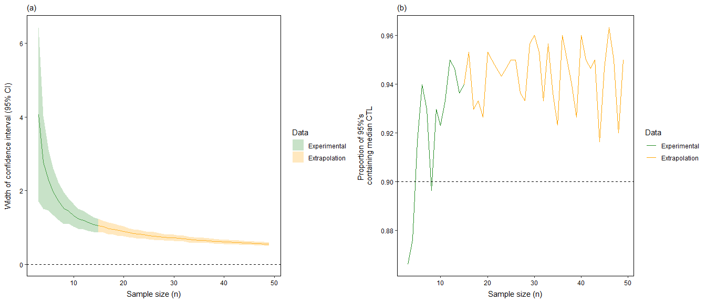

<!-- README.md is generated from README.Rmd. Please edit that file -->

# ThermalSampleR

`ThermalSampleR` is an R package and R Shiny GUI application designed
for assessing sample size requirements for researchers performing
critical thermal limits (CTL) studies (e.g. calculating CTmin or CTmax
metrics). Much research has been performed in recent years to improve
the methodology used during CTL studies, however, we are not aware of
any research into the sample size requirements for these studies. Our
package allows users to perform sample size assessments for both
single-species studies and multi-species comparisons, which will be
discussed in detail below and illustrated with full use-cases.

`ThermalSampleR` is a companion package to the pending publication
(currently under review):

Owen, C.A., Sutton, G.F., Martin, G.D., van Steenderen, C.J.M., and
Coetzee, J.A. Sample size planning for critical thermal limits studies.

## 1. Installation

**Via GitHub:**  
`devtools::install_github("CJMvS/ThermalSampleR")`

Once the package has been installed, you need to call the package into
your current R session:

``` r
library(ThermalSampleR)
```

**R Shiny Application:**

**Via GitHub:**  
`shiny::runUrl("https://github.com/CJMvS/ThermalSampleR_Shiny/archive/main.tar.gz")`

**Shiny Apps platform:**  
<https://clarkevansteenderen.shinyapps.io/ThermalSampleR_Shiny/>

## 2. Loading your raw data

A full worked example will be outlined in the following sections. The
first step is to load in your raw critical thermal limits raw data.
Input files must be saved in .csv format, with two columns: one column
containing unique species names (indicated by the `col` column below)
and another column containing the response variable, with each row
representing a single individual that has been tested (e.g. Critical
Thermal Limit temperature data) (indicated by the `response` column
below). For example, you can inspect the built-in example data
(`coried`) in `ThermalSampleR` to see how your data should be
structured:

``` r
coreid <- ThermalSampleR::coreid_data
head(coreid)
```

    ##                          col response
    ## 1 Catorhintha schaffneri_APM        5
    ## 2 Catorhintha schaffneri_APM        5
    ## 3 Catorhintha schaffneri_APM        5
    ## 4 Catorhintha schaffneri_APM        4
    ## 5 Catorhintha schaffneri_APM        4
    ## 6 Catorhintha schaffneri_APM        4

## 3. Sample size assessments - Single taxon

The simplest application of `ThermalSampleR` is to evaluate whether a
study has used a sufficient sample size to estimate the critical thermal
limits for a single taxon. Below, we perform these calculations to
estimate sample sizes required to accurately estimate the CTmin of
adults of the a twig-wilting insect *Catorhintha schaffneri* (denoted by
`Catorintha schaffneri_APM` in our dataframe).

We use a bootstrap resampling procedure to estimate the width of the 95%
confidence interval of our CTmin estimate across a range of sample
sizes, which defaults to starting at n = 3 individuals tested, and which
can be extrapolated to sample sizes greater than the sample size of your
existing data by specifying a value to `n_max`.

``` r
bt_one = boot_one(
  # Which dataframe does the data come from? 
  data = coreid_data, 
  # Provide the column name containing the taxon ID
  groups_col = col, 
  # Provide the name of the taxon to be tested
  groups_which = "Catorhintha schaffneri_APM", 
  # Provide the name with the response variable (e.g CTmin data)
  response = response, 
  # Maximum sample sample to extrapolate to 
  n_max = 49, 
  # How many bootstrap resamples should be drawn? 
  iter = 299)
head(bt_one)
```

    ## # A tibble: 6 x 14
    ## # Groups:   col, sample_size [1]
    ##   col   sample_size mean_low_ci mean_upp_ci mean_ct width_ci sd_width
    ##   <chr>       <int>       <dbl>       <dbl>   <dbl>    <dbl>    <dbl>
    ## 1 Cato~           3        2.83        6.89    4.86     4.07     2.37
    ## 2 Cato~           3        2.83        6.89    4.86     4.07     2.37
    ## 3 Cato~           3        2.83        6.89    4.86     4.07     2.37
    ## 4 Cato~           3        2.83        6.89    4.86     4.07     2.37
    ## 5 Cato~           3        2.83        6.89    4.86     4.07     2.37
    ## 6 Cato~           3        2.83        6.89    4.86     4.07     2.37
    ## # ... with 7 more variables: sd_width_lower <dbl>, sd_width_upper <dbl>,
    ## #   median_pop_val <dbl>, prop_ci_contain <dbl>, iter <int>, lower_ci <dbl>,
    ## #   upper_ci <dbl>

The resulting variable should then be passed to the `plot_one_group`
function to visualise the simulation results. A number of optional
parameters can be passed to the function to alter the aesthetics of the
graphs.

``` r
plot_one_group(
  # Variable containing the output from running `boot_one` function
  x = bt_one, 
  # Minimum sample size to plot
  n_min = 3, 
  # Actual size of your existing dataset 
  n_max = 15, 
  # Colour for your experimental data
  colour_exp = "forestgreen", 
  # Colour for the extrapolated predictions 
  colour_extrap = "orange", 
  # Position of the legened
  legend.position = "right", 
  # Change the degree of shading on the graph 
  alpha_val = 0.25)
```

<!-- -->

Inspecting panel (a), we visualisation the precision of our CTmin
estimate for *Catorhintha schaffneri*, whereby precision is measured as
the width of a 95% confidence interval. For example, in the context of
CTLs, a CI width of 1 indicates that practitioners can be 95% confident
that their CTL estimate is within 1 degree Celsius of the true CTmin
value. The smaller the CI width, the greater the precision of the CTL
estimate.

In this example, we can see that the 95% confidence interval is
estimated to reach a plateau once approximately n = 40 individuals are
tested. The plateau is in the extrapolated section of the graph
indicating that more individuals would need to be tested for the 95%
confidence interval to become stable. However, at the existing sample
size of n = 15, the researchers could be relatively confident that the
CTmin estimate they have obtained is accurate to about 1.2 - 1.5 degrees
Celsius. Researchers will need to decide for themselves what an
acceptable degree of uncertainty is for their own datasets.

Inspecting panel (b), we visualise the sampling distribution (i.e. the
range of plausible CTmin values) for the taxa under study. This
assessment can produce bias results at small sample sizes because the
population parameter (e.g. the taxons’ CTmin) is unknown, and therefore
must be estimated from the experimental data. Panel B gives an
indication of parameter estimation accuracy by plotting the proportion
of bootstrap resamples, across each sample size, for which the 95% CI
included the estimated population parameter. An accurate parameter
estimate should produce CI’s that, on \~ 95% of occasions, contain the
estimated population parameter.

In this example, we can see that the proportion of 95% CI’s containing
the estimated population parameter was often much lower than the
expectation that 95% of the CI’s for a given sample size should ideally
contain the population parameter. However, as noted above, because our
population parameter for *Catorhintha schaffneri* was estimated from n =
15 individuals tested, our assessment of parameter accuracy may be bias,
and thus, should be interpreted with caution.
